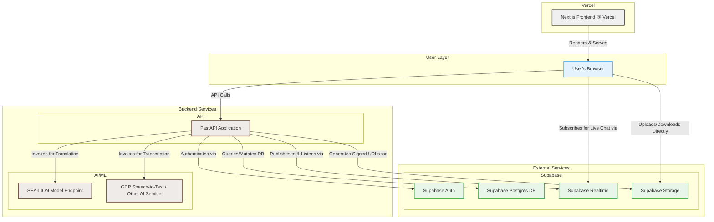

# LinguaLearn Bridge - Decoupled FastAPI Architecture

This document outlines the final technical architecture for the LinguaLearn Bridge application. This plan leverages a decoupled approach with a Python/FastAPI backend and a Next.js frontend, designed to allow for clear separation of concerns and to leverage the strengths of each framework.

**Core Philosophy:** Separate the AI/business logic (Python) from the user interface (TypeScript/React) to enable parallel development and utilize the best tools for each job.

### Component Breakdown:

1.  **Frontend (Vercel):**
    *   **Framework:** **Next.js with App Router**.
    *   **Responsibilities:** Building and rendering React components, managing UI state, and making authenticated API calls to the FastAPI backend.
    *   **UI/Forms:** shadcn/ui, Tailwind CSS, React Hook Form, and Zod for client-side validation.
    *   **API Client:** A typed API client (`src/lib/api/`) will be created to interact with the backend, providing type safety between the frontend and backend.

2.  **Backend (FastAPI):**
    *   **Framework:** **FastAPI** (Python).
    *   **Responsibilities:** Exposing RESTful API endpoints for all business logic, including user authentication, database operations, and orchestrating calls to AI services.
    *   **AI Orchestration:** Can use **LangChain** or a simple service client (`sea_lion_client.py`) to interact with AI models.

3.  **Authentication (Supabase):**
    *   **Service:** **Supabase Auth.**
    *   **Flow:** The Next.js frontend initiates sign-in/sign-up. The received JWT is sent to the FastAPI backend with every request. The backend validates the token using Supabase's public key to secure its endpoints.

4.  **Database (Supabase):**
    *   **Service:** **Supabase Postgres.**
    *   **Access:** The FastAPI backend will handle all database reads and writes.

5.  **Real-time Chat (Supabase):**
    *   **Service:** **Supabase Realtime.**
    *   **Flow:** The FastAPI backend, after persisting a message to the database, can broadcast an event using the Supabase Realtime client. Alternatively, the Next.js frontend can subscribe directly to database changes, simplifying the backend logic.

6.  **AI/ML (Innovation Hotspot):**
    *   **Primary AI Service:** **SEA-Lion Model Endpoint**.
    *   **Point of Innovation:** The **translation and transcription-translation** flows are the prime candidates for showcasing the SEA-Lion model's unique capabilities. Use it here to demonstrate superior handling of Southeast Asian languages, dialects, and cultural nuances compared to generic models.
    *   **Other AI Services:** Standard models (e.g., Gemini, GCP Speech-to-Text) can be used for less critical tasks like simplification or summarization where SEA-Lion's specialization is not required.

7.  **File Storage (Supabase):**
    *   **Service:** **Supabase Storage.**
    *   **Flow:** To upload a file, the frontend will request a secure, temporary upload link from the FastAPI backend. The frontend then uses this URL to upload the file directly to Supabase Storage.

This decoupled architecture provides a robust and scalable foundation for the LinguaLearn Bridge application.