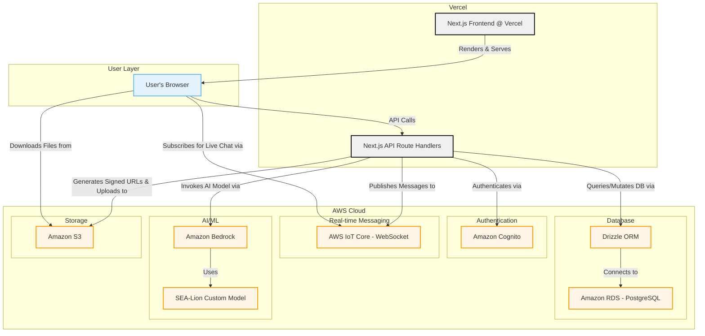

# LinguaLearn Bridge - AWS-Centric Architecture

This document outlines a pragmatic technical architecture for the LinguaLearn Bridge application, designed for rapid development within a 3-week hackathon timeline while leveraging the AWS ecosystem.

**Core Philosophy:** Utilize Vercel for what it excels at (frontend hosting) and Next.js Route Handlers for a fast, unified development experience. All stateful services (auth, database, storage, AI) will be handled by AWS to meet sponsor requirements.

### Component Breakdown:

1.  **Frontend (Vercel):**
    *   **Framework:** Next.js with React Server Components.
    *   **Hosting:** Deployed on Vercel for optimal performance, DX, and CDN.
    *   **UI:** Built with shadcn/ui and Tailwind CSS.
    *   **Forms:** React Hook Form (`RHF`) for managing form state and `Zod` for validation.
    *   **Responsibilities:** Renders all UI, handles user interactions, and makes API calls to its own backend.

2.  **Backend API (Next.js Route Handlers on Vercel):**
    *   **Location:** Lives in the `/app/api/...` directory of the Next.js project.
    *   **Responsibilities:**
        *   Handles all business logic.
        *   Communicates with AWS services using the AWS SDK for JavaScript v3.
        *   Acts as the secure intermediary between the client and the AWS backend. It's a "backend-for-frontend" (BFF) hosted on Vercel.

3.  **Authentication (AWS):**
    *   **Service:** **Amazon Cognito.**
    *   **Usage:** Manages user pools, sign-up, sign-in, and JWT (JSON Web Token) issuance. The frontend will use a library like `amazon-cognito-identity-js` or AWS Amplify's auth components. Route Handlers will validate the JWTs on every protected API call.

4.  **Database (AWS):**
    *   **Service:** **Amazon RDS for PostgreSQL.**
    *   **ORM:** **Drizzle ORM.** The Next.js backend will use Drizzle to make type-safe SQL queries to the RDS instance. This provides a better developer experience than writing raw SQL.
    *   **Schema:** Will store user profiles, chat messages, contacts, and AI-generated summaries.

5.  **Real-time Chat (AWS):**
    *   **Service:** **AWS IoT Core.**
    *   **Protocol:** MQTT over WebSockets.
    *   **Flow:**
        *   When a user sends a message, the Route Handler publishes it to a specific MQTT topic (e.g., `/chat/conversation_123`).
        *   Clients (browsers) subscribe to their relevant conversation topics.
        *   Messages are pushed instantly to all subscribed clients, creating a live chat experience.

6.  **AI/ML (AWS):**
    *   **Service:** **Amazon Bedrock.**
    *   **Model:** The **SEA-Lion model** will be imported into Bedrock as a provisioned throughput model.
    *   **Usage:** The Next.js Route Handlers will call the Bedrock API to perform translation, summarization, and other generative AI tasks.

7.  **File Storage (AWS):**
    *   **Service:** **Amazon S3.**
    *   **Usage:** Used to store user-uploaded files like voice notes (.mp3, .wav) and documents (.pdf).
    *   **Flow:** The Route Handler will generate a secure, pre-signed URL for uploading. The client then uses this URL to upload the file directly to the S3 bucket, which is more performant and secure than piping the file through the backend server.
