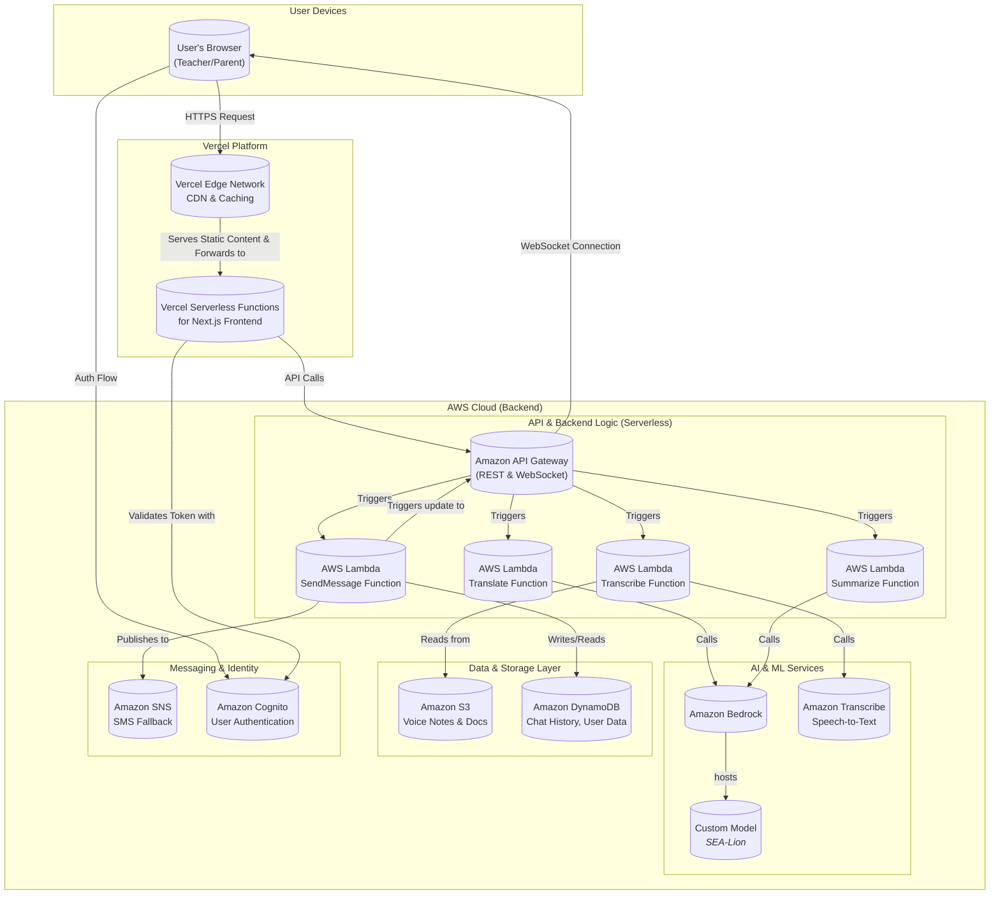

# SEA Bridge - Technical Architecture

This document outlines the technical architecture for the SEA Bridge application, designed with a hybrid-cloud approach utilizing Vercel for the frontend and Amazon Web Services (AWS) for the backend.



### Architecture Components Breakdown:

1.  **User Layer:**
    *   **User's Browser**: The client-side application running on the user's device.

2.  **Frontend Platform (Vercel):**
    *   **Vercel Edge Network**: Acts as the Content Delivery Network (CDN). It caches static assets (JS, CSS, images) at edge locations closer to the user, reducing latency.
    *   **Vercel Serverless Functions**: Vercel automatically deploys the Next.js frontend application onto its serverless compute infrastructure. This handles server-side rendering and serves the application to the user.

3.  **API & Backend (AWS):**
    *   **Amazon API Gateway**: Manages all API calls from the Vercel frontend. It provides both a REST API for standard requests (like initiating a translation) and a WebSocket API to enable real-time, two-way communication for the chat feature.
    *   **AWS Lambda**: Hosts the backend logic for individual AI tasks (translation, summarization, etc.) as separate, stateless functions, written in Node.js using the AWS SDK.

4.  **AI & ML Services (AWS):**
    *   **Amazon Bedrock**: A fully managed service that offers a choice of high-performing foundation models. It will be used to host and serve the custom **SEA-Lion Model**.
        *   **Custom Model (SEA-Lion)**: An imported model specializing in Southeast Asian languages, used for all translation and summarization tasks to ensure high accuracy and contextual understanding.
    *   **Amazon Transcribe**: Converts speech from voice notes into text.

5.  **Data & Storage (AWS):**
    *   **Amazon S3 (Simple Storage Service)**: Used for object storage. All user-uploaded content like voice notes and documents will be stored here.
    *   **Amazon DynamoDB**: A fully managed NoSQL database for storing structured data like user profiles, contacts, and chat message history.

6.  **Messaging & Identity (AWS):**
    *   **Amazon SNS (Simple Notification Service)**: Handles the sending of transactional SMS messages for the low-connectivity fallback feature.
    *   **Amazon Cognito**: Provides a complete solution for user identity management, including user registration, sign-in, and access control. This replaces the current `localStorage`-based session management.
```