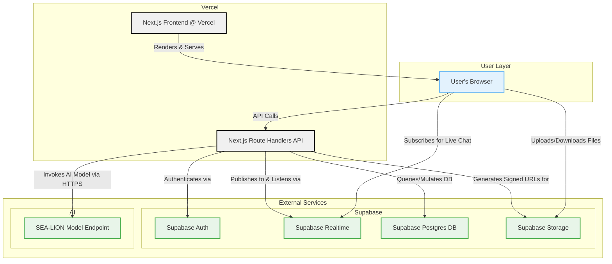

# LinguaLearn Bridge - Pragmatic Hackathon Architecture

This document outlines a pragmatic technical architecture for the LinguaLearn Bridge application, designed for rapid development within a 3-week hackathon timeline. The primary goal is to maximize developer velocity to focus on the core user experience and the innovative use of the SEA-LION LLM, which are the main judging criteria.

**Core Philosophy:** Use a tightly integrated, modern stack that minimizes infrastructure setup and maximizes feature development speed.

### Component Breakdown:

1.  **Frontend & Backend (Vercel):**
    *   **Framework:** Next.js with React Server Components.
    *   **API:** Next.js Route Handlers will serve as the backend. This co-location of frontend and backend code simplifies development, testing, and deployment immensely. It's a "backend-for-frontend" (BFF) hosted on Vercel.
    *   **UI:** Built with shadcn/ui and Tailwind CSS.
    *   **Forms:** React Hook Form (`RHF`) for managing form state and `Zod` for validation.

2.  **Authentication (Supabase):**
    *   **Service:** **Supabase Auth.**
    *   **Usage:** Manages user sign-up, sign-in, and JWT issuance. It's faster to implement than AWS Cognito and integrates seamlessly with Supabase's database for Row Level Security (RLS).

3.  **Database (Supabase):**
    *   **Service:** **Supabase Postgres.**
    *   **ORM:** **Drizzle ORM.** The Next.js backend will use Drizzle to make type-safe SQL queries to the Postgres instance.
    *   **Schema:** Will store user profiles, chat messages, contacts, and AI-generated summaries.

4.  **Real-time Chat (Supabase):**
    *   **Service:** **Supabase Realtime.**
    *   **Usage:** Provides real-time capabilities out-of-the-box, broadcasting database changes over WebSockets. When a new message is inserted into the database, Supabase will automatically push it to all subscribed clients. This is significantly simpler than configuring AWS IoT Core.

5.  **AI/ML (Hosted Endpoint):**
    *   **Service:** **SEA-Lion Model on a simple HTTPS Endpoint.**
    *   **Usage:** The Next.js Route Handlers will make secure `fetch` requests to this endpoint for all AI tasks (translation, summarization). This avoids the overhead of integrating the full AWS Bedrock SDK and is trivial to implement.

6.  **File Storage (Supabase):**
    *   **Service:** **Supabase Storage.**
    *   **Usage:** Used to store user-uploaded files like voice notes and documents. It integrates with Supabase Auth for simple and secure access policies, making it faster to wire up than S3.
