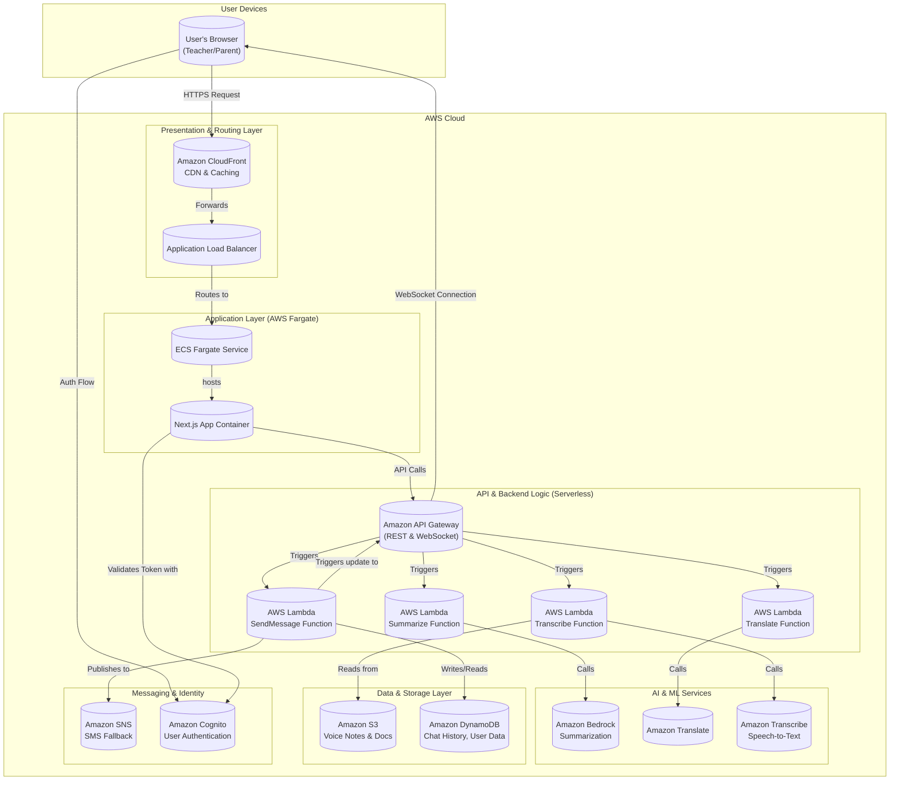

# SEA Bridge - AWS Technical Architecture

This document outlines the technical architecture for the SEA Bridge application, designed to run primarily on the Amazon Web Services (AWS) ecosystem.

### Architecture Components Breakdown:

1.  **User Layer:**
    *   **User's Browser**: The client-side application running on the user's device. This is the Next.js frontend built with React.

2.  **CDN & Load Balancing:**
    *   **Amazon CloudFront**: Acts as the Content Delivery Network (CDN). It caches static assets (JS, CSS, images) at edge locations closer to the user, reducing latency. It routes dynamic requests to the Application Load Balancer.
    *   **Application Load Balancer (ALB)**: Distributes incoming application traffic across multiple targets, such as the ECS Fargate containers, ensuring high availability and scalability.

3.  **Application Layer:**
    *   **AWS Fargate**: A serverless compute engine for containers. It runs the Next.js application inside a Docker container without requiring the management of servers or clusters. This is where the main application logic and UI rendering happens.

4.  **API & Backend (Serverless):**
    *   **Amazon API Gateway**: Manages all API calls. It provides both a REST API for standard requests (like initiating a translation) and a WebSocket API to enable real-time, two-way communication for the chat feature.
    *   **AWS Lambda**: Hosts the backend logic for individual AI tasks (translation, summarization, etc.) as separate, stateless functions. This approach is highly scalable and cost-effective, as you only pay for compute time when the functions are executed.

5.  **AI & ML Services:**
    *   **Amazon Translate**: Handles all language translation tasks.
    *   **Amazon Bedrock**: Provides access to powerful foundation models for complex tasks like message summarization.
    *   **Amazon Transcribe**: Converts speech from voice notes into text.

6.  **Data & Storage:**
    *   **Amazon S3 (Simple Storage Service)**: Used for object storage. All user-uploaded content like voice notes and documents will be stored here.
    *   **Amazon DynamoDB**: A fully managed NoSQL database for storing structured data like user profiles, contacts, and chat message history. It's chosen for its single-digit millisecond performance, which is ideal for a chat application.

7.  **Messaging & Identity:**
    *   **Amazon SNS (Simple Notification Service)**: Handles the sending of transactional SMS messages for the low-connectivity fallback feature.
    *   **Amazon Cognito**: Provides a complete solution for user identity management, including user registration, sign-in, and access control. This replaces the current `localStorage`-based session management.

This architecture is robust, scalable, and leverages managed AWS services to reduce operational overhead. Let me know if you would like me to elaborate on any of these components or flows!